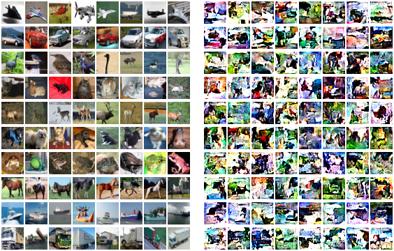

This repo provides a visual comparison between real training data and synthetic samples generated by $D^2FKD$. The primary objective is to demonstrate that our framework generates semantic class prototypes rather than performing instance-level memorization.

The synthetic samples function as generic class-level prototypes that capture shared semantic features rather than pixel-level replicas of specific private training instances.
